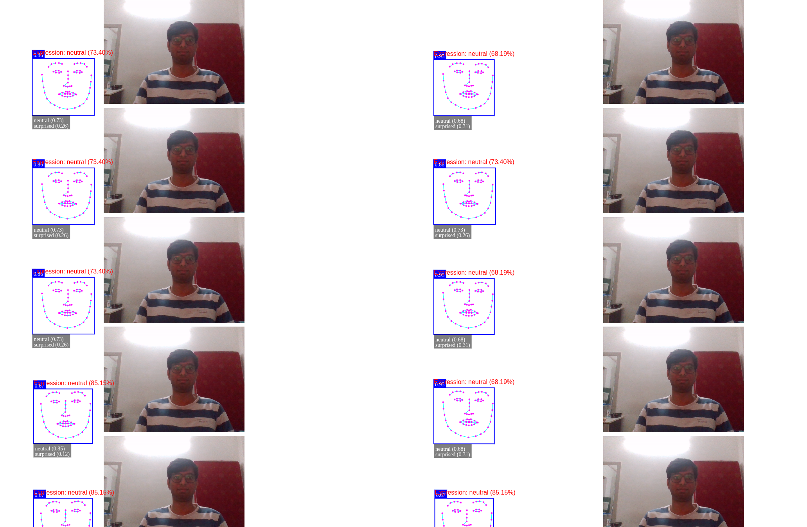
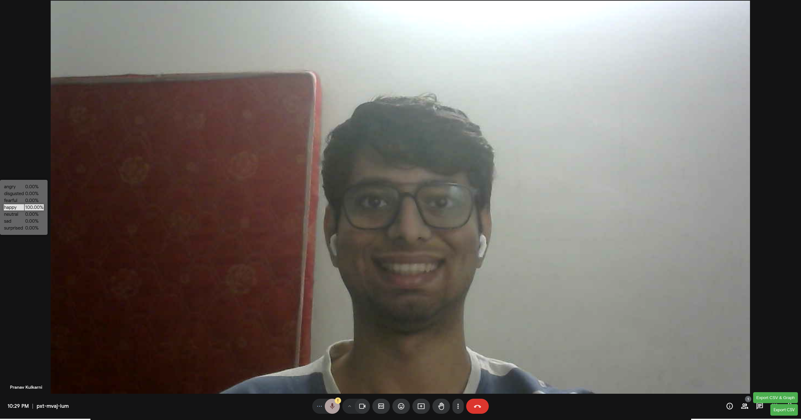
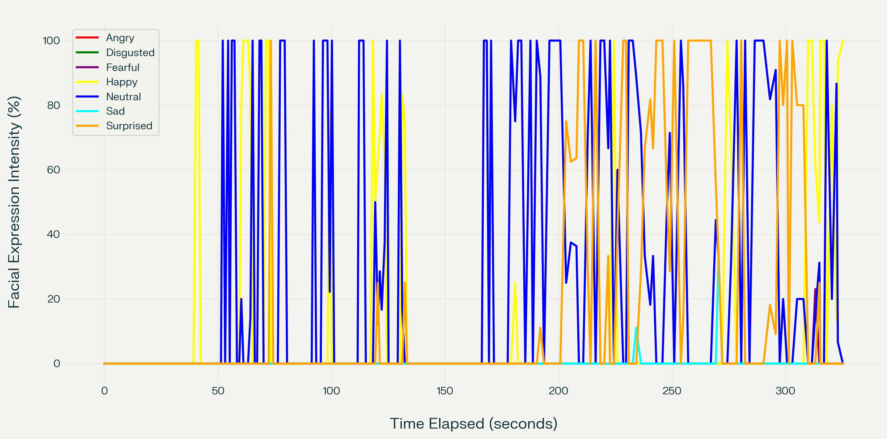

# facial-expression-detection

## This a design lab project for the semester spring 2024-25

### Kulkarni Pranav Suryakant (20CS30029)

The following is demonstration of the facial-expression detection model on 10 video input streams

The following is demonstration of the facial-expression chrome extension for gmeet

The following is a plot of the the detected expression vs time from the gmeet extension

