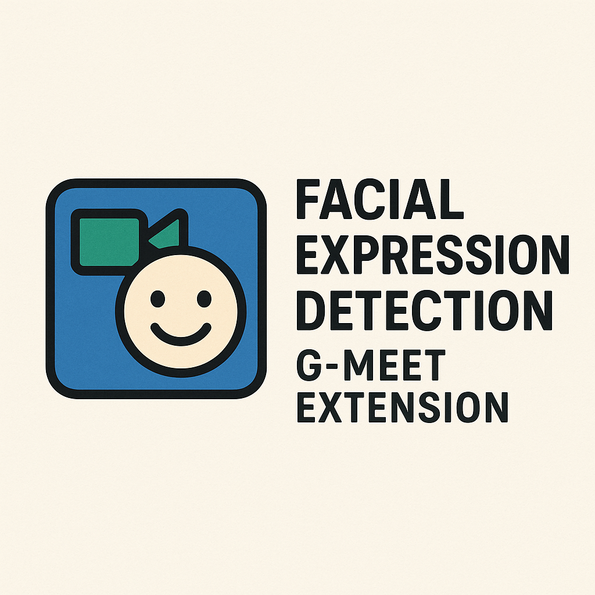
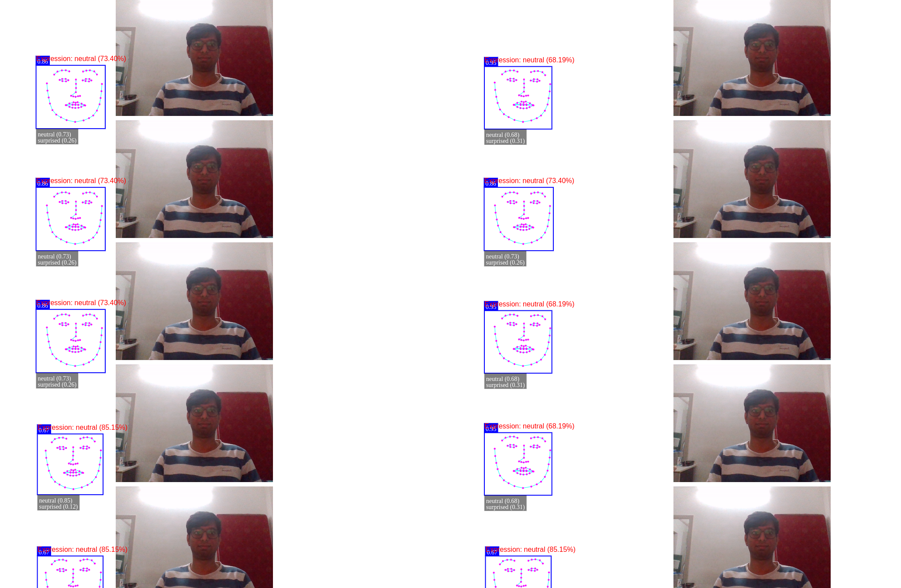
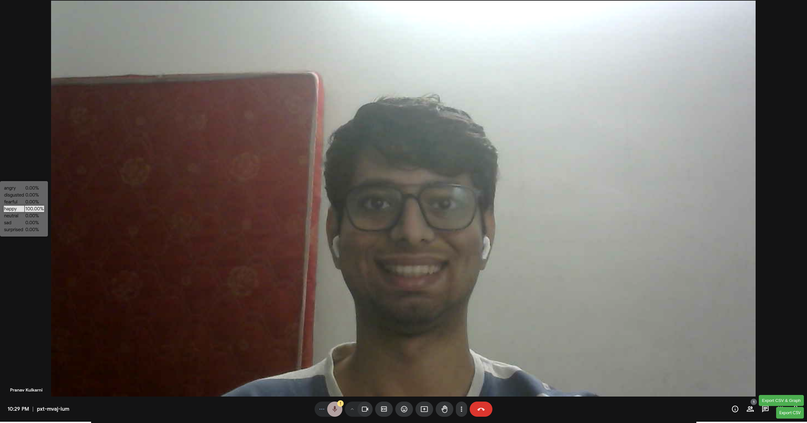
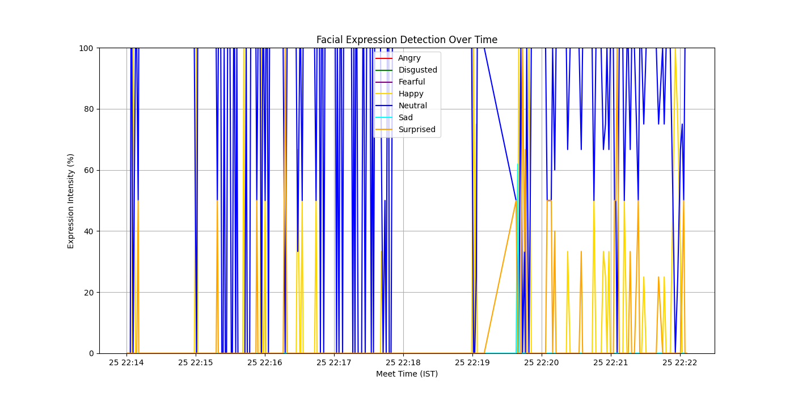

# facial-expression-detection


## This a design lab project () for the semester spring 2024-25

### Kulkarni Pranav Suryakant (20CS30029)

The following is demonstration of the facial-expression detection model on 10 video input streams


The following is demonstration of the facial-expression chrome extension for gmeet



The following is a plot of the the detected expression vs time from the gmeet extension


## Tech Stack:

- Javascript
- face-api.js
- Python

## The Chrome Extension:

The extension is built on top of the work done by the [hugozanini](https://github.com/hugozanini/meet-the-meeting). The extension provides more better features like round robin face mask detection on all the participants and feature to store logs of expression.

## Sample Log File:
```
Timestamp,Angry,Disgusted,Fearful,Happy,Neutral,Sad,Surprised
2025-04-25T16:44:00.662Z,0.00,0.00,0.00,0.00,0.00,0.00,0.00
2025-04-25T16:44:01.634Z,0.00,0.00,0.00,0.00,0.00,0.00,0.00
2025-04-25T16:44:03.333Z,0.00,0.00,0.00,0.00,0.00,0.00,0.00
2025-04-25T16:44:03.897Z,0.00,0.00,0.00,0.00,100.00,0.00,0.00
2025-04-25T16:44:04.680Z,0.00,0.00,0.00,0.00,100.00,0.00,0.00
2025-04-25T16:44:05.738Z,0.00,0.00,0.00,100.00,0.00,0.00,0.00
2025-04-25T16:44:06.738Z,0.00,0.00,0.00,50.00,50.00,0.00,0.00
2025-04-25T16:44:07.821Z,0.00,0.00,0.00,0.00,100.00,0.00,0.00
2025-04-25T16:44:08.934Z,0.00,0.00,0.00,0.00,100.00,0.00,0.00
2025-04-25T16:44:10.165Z,0.00,0.00,0.00,0.00,50.00,0.00,50.00
2025-04-25T16:44:10.692Z,0.00,0.00,0.00,0.00,100.00,0.00,0.00
2025-04-25T16:44:11.809Z,0.00,0.00,0.00,0.00,100.00,0.00,0.00
```